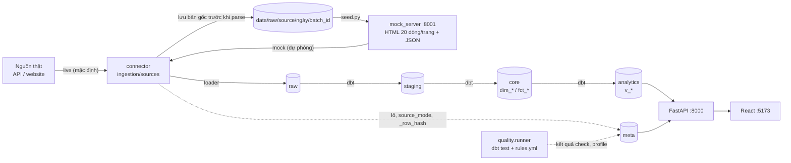

# QTDL Warehouse — PostgreSQL warehouse + web dashboard

Warehouse PostgreSQL nhiều tầng (`raw → staging → core → analytics`, cộng `meta`) với ingestion có nhật ký lô, mock server làm đường dự phòng cho nguồn, transform bằng dbt, cổng chất lượng tự động và dashboard React hiển thị cả kết quả phân tích lẫn sức khỏe dữ liệu.

**Trạng thái:** M1–M4 xong, chạy trên nguồn giả `source_demo`. Topic chưa chốt; M5 thay bằng nguồn thật.

| Mốc | Nội dung | Trạng thái |
|---|---|---|
| M1 | Khung, Docker, migration, CI | ✅ |
| M2 | Connector mẫu `source_demo` đi hết đường ống, idempotent | ✅ |
| M2b | Mock server phát lại bản gốc, `SOURCE_MODE=live\|mock`, lô live và mock khớp `_row_hash` | ✅ |
| M3 | dbt staging/core/analytics + quality gate (exit 1 khi hỏng) | ✅ |
| M4 | FastAPI + dashboard: Tổng quan, Sức khỏe pipeline, Catalog | ✅ |
| M5 | Nguồn thật | ⏳ chờ chốt topic |
| M6 | Phân tích, trang Khám phá + Phân tích | ⏳ |
| M7 | Tài liệu, báo cáo | ⏳ |

## Chạy

Máy chỉ cần **git, Docker (đang chạy), make**. Không cần cài Python/Node/Postgres. Windows: `winget install ezwinports.make`.

```bash
git clone https://github.com/nmdbbb/DVG6.git && cd DVG6
cp .env.example .env    # tùy chọn
make up && make migrate && make ingest && make transform && make quality
make dashboard          # http://localhost:5173 · API: http://localhost:8000/docs
```

| Lệnh | Việc |
|---|---|
| `make all` | up → migrate → ingest → transform → quality |
| `make ingest SOURCE_MODE=mock` | nạp từ mock server thay vì nguồn thật (mặc định `live`) |
| `make mock-check` | nạp live rồi mock, so khớp số dòng và `_row_hash` của hai lô |
| `make mock` | chạy riêng mock server, http://localhost:8001 |
| `make reset` | xóa sạch warehouse rồi dựng lại từ số không |
| `make test` | pytest (API trên database thật, ingestion, mock server) |
| `make lint` | ruff + black |
| `make lineage` | dbt docs + lineage graph, http://localhost:8080 |
| `make demo-break` | làm hỏng một dòng để thấy `make quality` chặn pipeline |
| `make psql` | mở psql |

Chi tiết và lỗi thường gặp: [docs/runbook.md](docs/runbook.md).

---

## Kiến trúc



- **Hai đường lấy dữ liệu.** `live` gọi nguồn thật và lưu từng trang gốc xuống `data/raw/` trước khi parse. `mock` crawl mock server, nơi phát lại đúng các trang đó (trễ 200–500 ms, 60 request/phút rồi 429). Chọn bằng `SOURCE_MODE` hoặc `--endpoint`; mỗi lô ghi `source_mode` vào `meta.ingestion_batch`. Hai đường cho cùng `_row_hash` trong raw.
- **Raw bất biến.** `etl_writer` chỉ có `INSERT` trên `raw`; khử trùng lặp theo `_row_hash`.
- **Một chiều.** `raw → staging → core → analytics`; API chỉ đọc `analytics` + `meta` bằng role `api_reader`.
- **Quality là cổng.** Check `error` fail thì `make quality` exit 1 và pipeline dừng; kết quả nằm trong `meta.quality_run` để dashboard đọc.

```
db/            migration, role, seed
ingestion/     connector, loader, CLI, http client
mock_server/   đường dự phòng: seed.py đọc data/raw, app.py phát lại
transform/     dbt: staging, core, analytics
quality/       rules.yml, runner
analysis/      notebook, report
api/           FastAPI
web/           React + Vite + ECharts
docs/          contract, log, runbook
scripts/       migrate, reset, compare_batches, demo_break
common/        kết nối DB dùng chung
data/          KHÔNG commit (bản gốc từ nguồn, export)
```

Chi tiết schema và phân quyền: [docs/schema.md](docs/schema.md).

---

## Nhận nhiệm vụ

### a) Bảng phân vai — điền tên vào cột "Người"

Mỗi vai **sở hữu** workspace của mình. Sửa ngoài workspace phải hỏi người sở hữu trước (quy tắc chung ở cuối mục).

| # | Vai | Người | Workspace (sở hữu) | Nhãn issue | Nhánh |
|---|---|---|---|---|---|
| 1 | **Data Architect & Integration Owner** | Đ | [db/](db/) · [scripts/](scripts/) (trừ `compare_batches.py`) · [common/](common/) · [docker-compose.yml](docker-compose.yml) · [Dockerfile](Dockerfile) · [Makefile](Makefile) · [.github/](.github/) · [docs/schema.md](docs/schema.md) · [docs/data_contract.md](docs/data_contract.md) · [docs/decision_log.md](docs/decision_log.md) · [docs/runbook.md](docs/runbook.md) | `role:architect` | `db/…` |
| 2 | **Analysis Lead & Quality Owner** | `<tên>` | [quality/](quality/) (`rules.yml`, `runner.py`, `checks/`) · [docs/business_case.md](docs/business_case.md) · [docs/quality_report.md](docs/quality_report.md) (sinh tự động) | `role:quality` | `quality/…` |
| 3 | **Source & Crawler A** | `<tên>` | `ingestion/sources/<a>.py` · khung ingestion chung: [ingestion/base.py](ingestion/base.py), [loader.py](ingestion/loader.py), [http_client.py](ingestion/http_client.py), [cli.py](ingestion/cli.py), [registry.py](ingestion/registry.py) · [ingestion/tests/](ingestion/tests/) · mục nguồn A trong [docs/sources.md](docs/sources.md) | `role:crawler-a` | `ingest/…` |
| 4 | **Crawler B & Mock server** | `<tên>` | `ingestion/sources/<b>.py` · [mock_server/](mock_server/) (`seed.py`, `app.py`, `tests/`) · [scripts/compare_batches.py](scripts/compare_batches.py) · mục nguồn B và mẫu chung trong [docs/sources.md](docs/sources.md) | `role:crawler-b` | `ingest/…`, `mock/…` |
| 5 | **Transform** | `<tên>` | [transform/](transform/) (`models/staging`, `models/core`, `models/analytics`, `macros/`, `dbt_project.yml`) · [docs/cleaning_log.md](docs/cleaning_log.md) | `role:transform` | `transform/…` |
| 6 | **Analysis & Visualization** | `<tên>` | [analysis/](analysis/) (`notebooks/`, `reports/`) | `role:analysis` | `analysis/…` |
| 7 | **Dashboard** | `<tên>` | [api/](api/) (`main.py`, `routers/`, `schemas/`, `tests/`) · [web/](web/) (`src/pages`, `src/components`, `src/api`, `src/lib`) | `role:dashboard` | `web/…`, `api/…` |

Bảng raw của nguồn mới là một migration trong `db/`: người viết connector soạn, Data Architect duyệt.

### b) Cách nhận việc

1. **Lấy issue theo nhãn trùng vai của bạn:** vào tab Issues, lọc `label:role:<vai>` (ví dụ [role:crawler-a](https://github.com/nmdbbb/DVG6/issues?q=is%3Aopen+label%3Arole%3Acrawler-a)). Issue chưa có ai nhận thì **tự assign** cho mình (Assignees → assign yourself, hoặc `gh issue edit <số> --add-assignee @me`).
2. **Tạo nhánh `<vai>/<việc>`** từ `main` mới nhất, ví dụ `ingest/source-a`, `mock/rate-limit`, `transform/dim-country`, `web/explore-page`:
   ```bash
   git switch main && git pull
   git switch -c ingest/source-a
   ```
3. **Làm xong mở pull request** vào `main`, trong mô tả ghi `Closes #<số issue>` để issue tự đóng khi merge. Điền checklist trong PR template.
4. Việc chạm nhiều vai hoặc chưa có nhãn → hỏi Data Architect gán nhãn trước khi làm.

### c) Điều kiện merge

| PR chạm gì | Ai duyệt | Phải kèm gì |
|---|---|---|
| `db/` hoặc `transform/models/core/` | Data Architect | Dòng mới trong [docs/decision_log.md](docs/decision_log.md) nếu có đánh đổi |
| Code làm sạch dữ liệu (`transform/models/`) | Data Architect | Dòng mới trong [docs/cleaning_log.md](docs/cleaning_log.md) kèm số dòng trước/sau |
| `analysis/` hoặc kết luận thống kê | Analysis Lead | Giả định mô hình đã kiểm (ghi trong notebook hoặc mô tả PR) |
| Còn lại | Một người bất kỳ | CI xanh |

**Mọi PR đều cần CI xanh** (`lint` + `pipeline`); branch protection chặn nút merge khi CI đỏ. Người duyệt bắt buộc được gán tự động qua [.github/CODEOWNERS](.github/CODEOWNERS).

**Quy tắc chung:** sửa ngoài thư mục mình sở hữu thì phải hỏi người sở hữu — comment vào issue hoặc thêm họ làm reviewer của PR trước khi merge.

---

## Mô tả công việc

Mỗi vai: mục tiêu, việc cụ thể theo mốc, ai cần phối hợp, và khi nào coi là xong.

<details>
<summary><b>1. Data Architect & Integration Owner</b> — giữ cấu trúc và hợp đồng dữ liệu</summary>

**Mục tiêu:** cả nhóm ghi vào một warehouse có cấu trúc nhất quán, dựng lại được từ số không bằng một lệnh.

**Việc chính**
- Chốt [docs/data_contract.md](docs/data_contract.md) sau buổi chọn topic: danh sách bảng core và grain, khóa nối giữa các nguồn, quy tắc NULL, đơn vị, múi giờ.
- Viết migration trong `db/migrations/` (file mới, không sửa file đã merge), mọi bảng/cột có `COMMENT ON`. Soạn cùng Crawler A/B bảng raw cho từng nguồn.
- Giữ [db/roles.sql](db/roles.sql), Docker Compose, Makefile, CI; duyệt mọi PR chạm `db/` và `transform/models/`.
- Ghi mọi quyết định có đánh đổi vào [docs/decision_log.md](docs/decision_log.md); giữ [docs/runbook.md](docs/runbook.md) đúng với cách chạy hiện tại.
- Gán nhãn issue, bảo đảm mỗi vai luôn có việc trong hàng đợi.

**Phối hợp:** Crawler A/B (bảng raw), Transform (grain, khóa), Analysis Lead (ngưỡng chất lượng ảnh hưởng schema).

**Xong khi:** contract chốt; `make reset && make all` chạy sạch trên máy trống; người ngoài nhóm đọc README + runbook dựng lại được.
</details>

<details>
<summary><b>2. Analysis Lead & Quality Owner</b> — câu hỏi nghiên cứu và cổng chất lượng</summary>

**Mục tiêu:** mọi con số trong báo cáo trả lời đúng câu hỏi nghiên cứu và đứng trên dữ liệu đã qua kiểm tra.

**Việc chính**
- Viết [docs/business_case.md](docs/business_case.md): bài toán, câu hỏi nghiên cứu, kế hoạch thống kê (biến, phương pháp, giả định cần kiểm).
- Đặt ngưỡng chất lượng trong [quality/rules.yml](quality/rules.yml): khóa, toàn vẹn tham chiếu, đối chiếu số dòng raw → core, tỉ lệ NULL, miền giá trị, độ tươi, ngoại lai. Đổi ngưỡng phải có lý do trong decision log.
- Khi đổi nguồn ở M5: cập nhật check `raw_to_core_row_reconciliation` và thêm check miền giá trị cho dữ liệu thật.
- Duyệt mọi PR `analysis/` và mọi kết luận thống kê: giả định mô hình đã kiểm chưa, số liệu tái tạo được từ warehouse không.

**Phối hợp:** Transform (check nào khai báo trong `schema.yml`), Analysis & Visualization (kế hoạch thống kê), Dashboard (trang Pipeline health đọc `meta.quality_run`).

**Xong khi:** câu hỏi nghiên cứu chốt; `make quality` chặn được dữ liệu hỏng; mỗi kết luận trong báo cáo có người duyệt.
</details>

<details>
<summary><b>3. Source & Crawler A</b> — nguồn A và khung ingestion chung</summary>

**Mục tiêu:** nguồn A vào `raw` đầy đủ, đúng nguyên trạng, chạy lại không sinh trùng; khung ingestion đủ dùng cho mọi nguồn.

**Việc chính**
- Viết `ingestion/sources/<a>.py` kế thừa `Connector`: `fetch_live()` (dùng `http_client.get()` để tôn trọng rate limit, `robots.txt`; có API chính thức thì dùng API), `parse()`, `describe()`. Nguồn là API thì override `render_api_page()` cho đúng hình dạng response thật để mock phát lại.
- Không làm sạch trong connector: không đổi tên cột, không ép kiểu, không lọc dòng.
- Giữ khung chung `base.py`, `loader.py`, `http_client.py`, `cli.py`, `registry.py` và test của chúng. Đổi chữ ký `Connector` phải báo Crawler B.
- Viết mục nguồn A trong [docs/sources.md](docs/sources.md): URL, giấy phép, tần suất, khóa định danh, data dictionary.

**Phối hợp:** Data Architect (migration bảng raw), Crawler B (mock phát lại nguồn A), Transform (staging của nguồn A).

**Xong khi:** `make ingest SOURCE=<a>` chạy hai lần, lần hai ghi 0 dòng mới; bản gốc nằm ở `data/raw/<a>/`; `make mock-check SOURCE=<a>` khớp.
</details>

<details>
<summary><b>4. Crawler B & Mock server</b> — nguồn B và đường dự phòng</summary>

**Mục tiêu:** nguồn B vào `raw` như nguồn A; pipeline vẫn chạy được khi nguồn thật chậm, bị chặn hoặc đổi cấu trúc.

**Việc chính**
- Viết `ingestion/sources/<b>.py` theo cùng hợp đồng `Connector` như nguồn A. Nguồn là trang web thì đặt `mock_format = "html"`.
- Giữ [mock_server/](mock_server/): `seed.py` đọc bản gốc trong `data/raw/` (không sinh dữ liệu giả), `app.py` phát lại dạng HTML 20 dòng/trang có link next và JSON cùng hình dạng API thật; trễ 200–500 ms, 60 request/phút rồi 429; không trả 500 ngẫu nhiên.
- Giữ [scripts/compare_batches.py](scripts/compare_batches.py) và `make mock-check`: lô live và lô mock phải trùng số dòng và tập `_row_hash`.
- Giữ mẫu chung và mục nguồn B trong [docs/sources.md](docs/sources.md).

**Phối hợp:** Crawler A (khung connector, `render_api_page`), Data Architect (service `mock_server` trong compose), Analysis Lead (chạy lại pipeline nhanh bằng mock).

**Xong khi:** `make ingest SOURCE=<b>` idempotent; `make mock-check` khớp cho mọi nguồn; test trong `mock_server/tests/` xanh.
</details>

<details>
<summary><b>5. Transform</b> — từ raw tới star schema</summary>

**Mục tiêu:** `core` là star schema sạch, đúng grain, mọi phép làm sạch có lý do và số dòng.

**Việc chính**
- **Staging** `stg_<nguồn>__<thực thể>.sql`: một model mỗi bảng raw — đổi tên, ép kiểu, trim, chuẩn hóa hoa/thường, lọc lô fail. Không join, không bỏ dòng.
- **Core** `dim_*.sql`, `fct_*.sql`: khử trùng lặp, gán khóa thay thế, dòng không map được dimension trỏ về `-1`.
- **Analytics** `v_<câu hỏi>.sql`: một view cho mỗi biểu đồ hoặc bảng kết quả mà Dashboard và Analysis cần.
- Mỗi model có `description` cho bảng và từng cột trong `schema.yml` (thành `COMMENT ON`), test `unique` / `not_null` / `relationships` cho khóa.
- Mỗi phép làm sạch một dòng trong [docs/cleaning_log.md](docs/cleaning_log.md) kèm số dòng trước/sau — không có thì không merge.

**Phối hợp:** Data Architect (duyệt mọi PR `transform/models/`), Crawler A/B (ý nghĩa cột raw), Dashboard + Analysis (view họ cần).

**Xong khi:** `make transform && make quality` xanh trên dữ liệu thật; lineage (`make lineage`) đi được từ mọi bảng core về raw.
</details>

<details>
<summary><b>6. Analysis & Visualization</b> — EDA, mô hình, hình cho báo cáo</summary>

**Mục tiêu:** trả lời câu hỏi nghiên cứu bằng phân tích tái tạo được, kèm hình đủ chất lượng đưa thẳng vào báo cáo.

**Việc chính**
- Notebook EDA và regression trong `analysis/notebooks/`, đọc từ `core`/`analytics` bằng role `analyst` (`ANALYST_PASSWORD`), không đọc file rời.
- Kiểm giả định mô hình (phân phối phần dư, đa cộng tuyến, phương sai sai số…) và ghi kết quả kiểm ngay trong notebook.
- Ghi kết quả (hệ số, sai số chuẩn, p-value, R², ma trận tương quan) vào bảng để API `/analysis/*` phục vụ — không có số nào chỉ tồn tại trong notebook.
- Xuất hình và bảng cho báo cáo vào `analysis/reports/`.

**Phối hợp:** Analysis Lead (kế hoạch thống kê, duyệt kết luận), Transform (view `analytics` cần thêm), Dashboard (trang Phân tích, Khám phá).

**Xong khi:** mỗi câu hỏi nghiên cứu có notebook chạy lại từ đầu ra cùng kết quả; Analysis Lead đã duyệt.
</details>

<details>
<summary><b>7. Dashboard</b> — API và giao diện</summary>

**Mục tiêu:** dashboard hiện kết quả phân tích và sức khỏe dữ liệu, mọi con số lấy từ warehouse.

**Việc chính**
- API trong [api/](api/): chỉ đọc `analytics` + `meta` qua role `api_reader`; response bọc `{data, meta}`; tham số qua Pydantic + bind parameter. Endpoint M6 đã có chỗ ở `routers/explore.py`, `routers/analysis.py`.
- Mỗi endpoint một test trong `api/tests/`, chạy trên database thật.
- Frontend trong [web/](web/): trang Khám phá và Phân tích (M6), giữ Tổng quan, Sức khỏe pipeline, Catalog. Mỗi biểu đồ trong `ChartCard` (hiện `as_of` + nguồn, nút Tải CSV), bộ lọc trên URL qua `FilterBar`.
- Đổi API thì chạy `cd web && npm run gen:api` để sinh lại type, không gõ tay interface.

**Phối hợp:** Transform (view analytics), Analysis & Visualization (bảng kết quả), Analysis Lead (cách hiển thị check chất lượng).

**Xong khi:** đủ 5 trang; không có số hard-code; mỗi endpoint có test; CI xanh.
</details>

---

Tài liệu: [schema](docs/schema.md) · [data contract](docs/data_contract.md) · [nguồn](docs/sources.md) · [decision log](docs/decision_log.md) · [cleaning log](docs/cleaning_log.md) · [quality report](docs/quality_report.md) · [runbook](docs/runbook.md) · [business case](docs/business_case.md)
