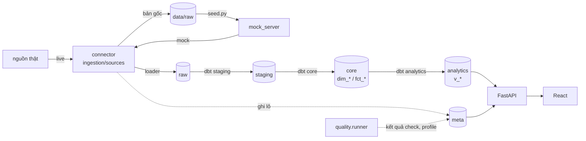
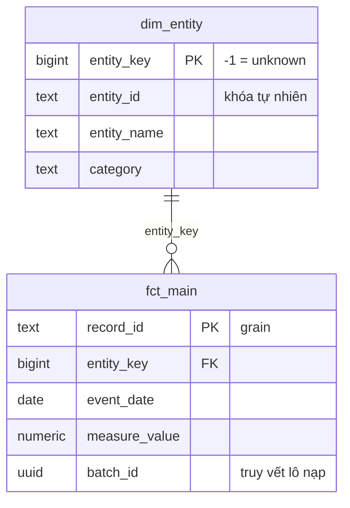

# Schema warehouse

Một database `qtdl`, chia tầng bằng schema. Dữ liệu chảy một chiều.

## Star schema hiện tại (dữ liệu giả)

| Bảng | Grain (một câu) | Dựng bởi |
|---|---|---|
| `raw.source_demo_records` | Một dòng cho mỗi bản ghi gốc khác nhau (`_row_hash`) | `ingestion/loader.py`, migration `003` |
| `staging.stg_source_demo__records` | Một dòng cho mỗi dòng raw thuộc lô success | dbt (view) |
| `core.dim_entity` | Một dòng cho mỗi `entity_id`, cộng dòng unknown `-1` | dbt (table) |
| `core.fct_main` | Một dòng cho mỗi `record_id` | dbt (table) |
| `analytics.v_measure_by_category_month` | Một dòng cho mỗi (tháng, nhóm) | dbt (view) |

## meta

| Bảng | Ghi bởi | Nội dung |
|---|---|---|
| `meta.schema_version` | `scripts/migrate.py` | migration đã áp dụng + checksum |
| `meta.source` | loader | danh mục nguồn |
| `meta.ingestion_batch` | loader | một dòng mỗi lần chạy connector; `source_mode` = live hoặc mock |
| `meta.ingestion_batch_row` | loader | mọi `_row_hash` mỗi lô đã lấy về (kể cả đã có trong raw) — so lô live/mock |
| `meta.quality_run` | `quality/runner.py` | kết quả từng check, nhóm theo `run_id` |
| `meta.table_profile`, `meta.column_profile` | `quality/runner.py` | số dòng, tỉ lệ NULL mọi bảng |

## Cột kỹ thuật bắt buộc ở mọi bảng raw

`_batch_id uuid not null`, `_source_name text not null`, `_ingested_at timestamptz not null default now()`, `_row_hash text not null` (unique index), `_payload jsonb`.

## Phân quyền (`db/roles.sql`)

| Role | raw | staging | core | analytics | meta |
|---|---|---|---|---|---|
| `etl_writer` | SELECT, INSERT | owner | owner | owner | SELECT, INSERT, UPDATE |
| `api_reader` | — | — | — | SELECT | SELECT |
| `analyst` | — | — | SELECT | SELECT | — |

Mô tả chi tiết từng cột: trang **Catalog** trên dashboard (đọc từ `COMMENT ON`), hoặc `make lineage` để xem lineage graph của dbt.
